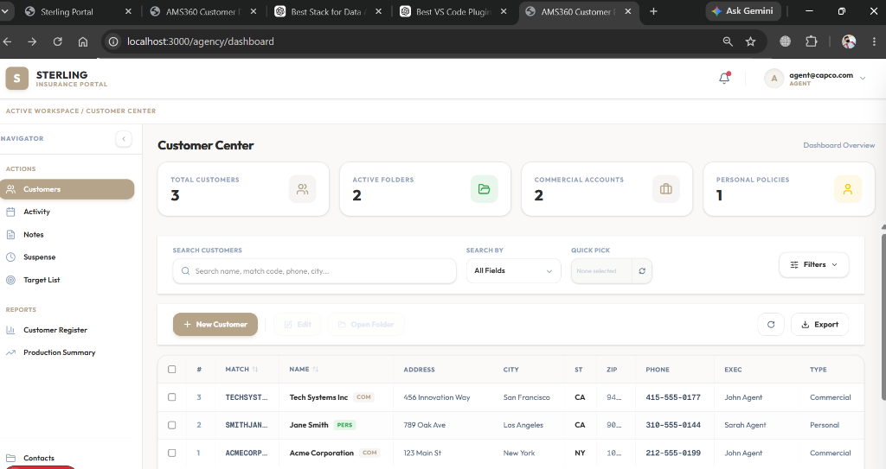

# AMS360 — Insurance Management System

An AMS360-style CRM and Insurance Management platform built with **Next.js 15** (frontend) and **FastAPI + PostgreSQL/Supabase** (backend).



---

## Table of Contents

1. [Project Overview](#project-overview)
2. [Recent Updates & Current Status](#recent-updates--current-status)
3. [UI/UX Walkthrough (Sterling Theme)](#uiux-walkthrough-sterling-theme)
4. [Project Architecture](#project-architecture)
5. [Folder Structure](#folder-structure)
6. [Domain Rules](#domain-rules)
7. [API Rules](#api-rules)
8. [Naming Rules](#naming-rules)
9. [Backend Development Standards](#backend-development-standards)
10. [Frontend Development Standards](#frontend-development-standards)
11. [Team Guidelines](#team-guidelines)
12. [Running the Project](#running-the-project)
13. [ALL FUTURE FILES MUST FOLLOW THIS STRUCTURE](#all-future-files-must-follow-this-structure)

---

## Project Overview

AMS360 is a multi-role insurance agency management system with:
- **Agent / Agency** role: Manage customers, search, filter, export, and create detailed customer profiles
- **Admin** role: System statistics, user management, role assignment

### Tech Stack

| Layer | Technology |
|---|---|
| Frontend | Next.js 15, TypeScript, TailwindCSS |
| Backend | FastAPI (Python 3.11+) |
| Database | PostgreSQL via Supabase |
| Auth | Supabase Auth (JWT Bearer tokens) |
| ORM | SQLAlchemy 2.0 |
| Validation | Pydantic v2 |

---

## Recent Updates & Current Status

**Current Stage:** We have successfully implemented the core Customer Center and Document Generation modules. 

**Recent Features Added:**
- **Customer Center & Policies:** Implemented full policy management screens (`/agency/customer/[id]/policy` and `/agency/customer/[id]/new-policy`), allowing agents to view and manage active policies associated with a customer.
- **eForms Manager & Print Options:** Built a comprehensive tree-based UI for managing certificates and forms. It supports master/holder hierarchies, adding/editing holders, copying masters, and a robust print-options flow for generating certificates.
- **ACORD 25 PDF Generation:** Implemented a new backend `pdf` module that integrates seamlessly with the frontend. It maps UI state into an ACORD 25 Certificate of Liability JSON payload and generates a fully flattened PDF document with the agency, insured, coverages, and certificate holder details filled in.
- **Drag & Drop Reordering:** Enabled drag-and-drop file organization inside the eForms manager.

---

## UI/UX Walkthrough (Sterling Theme)

The customer portal and forms have been completely modernized with a premium SaaS look inspired by the **Sterling Insurance** dashboard theme.

### Key Visual & UX Modernization Features
- **Aesthetic Brand Overhaul**: Configured brand-aligned color tokens (gold-taupe, light sand, and neutral backgrounds), elegant drop-shadows, and spacious cell/layout layouts using the premium `Outfit` typography.
- **Metrics Summary Widgets**: Beautiful card widgets placed at the top of the dashboard displaying vital counts (`Total Customers`, `Active Folders`, `Commercial Accounts`, `Personal Policies`) with distinct, clean SVG icons.
- **Collapsible Sidebar Layout**: Clean navigational panel housing navigation categories, quick items, and reports. Supports collapsible layout toggles.
- **Unified Profile & sliding Drawer Menu**:
  - **User Profile Menu**: A custom dropdown in the top-right header showing user information (avatar, email, role), a profile link, and a logout action.
  - **Right Drawer Panel**: A sliding container with a backdrop-blur overlay. Features a nested navigation setup that goes from the "Main Menu" to a "Quick Actions" submenu (housing *New Activity*, *New Suspense*, *eForms*, *New Note*, *Form Letters*, and *Daily Process* actions) and back.
- **Form Sections Creation Layout**:
  - Restructured the New Customer creation page to include a `Form Sections` left-hand layout checklist.
  - Toggling items dynamically swaps focus to corresponding input fields.
  - Custom tables with dynamic row insertion and removal for *Service Groups*, *Contacts*, *Dependents*, *Loss History*, and *Cross References*.
  - Strict key filtering on submit prevents backend API schema incompatibilities.

### Dashboard Preview


---

## Project Architecture

```
AMS-project-main/
├── frontend/           Next.js 15 app (source of truth for features)
│   └── src/
│       ├── app/        Next.js App Router pages
│       ├── components/ Shared React components
│       ├── data/       TypeScript type definitions
│       └── lib/        Utilities and config (API_BASE_URL)
│
└── backend/            FastAPI application
    └── app/
        ├── api/v1/     Route aggregator only (router.py)
        ├── modules/    All business logic (domain modules)
        ├── core/       App settings (config.py)
        └── database/   DB engine and session (connection.py)
```

### Architecture Principles

1. **Frontend is Source of Truth** — the backend serves what the frontend needs, nothing more
2. **Module-based** — every domain is a self-contained folder under `modules/`
3. **No Parallel Implementations** — logic exists in exactly one place
4. **Thin Routers** — route handlers only handle HTTP; business logic lives in `service.py`
5. **Repository Pattern** — all DB queries are in `repository.py`, never inline in routes

---

## Folder Structure

### Backend

```
backend/
├── .env                        Environment variables (DATABASE_URL, Supabase keys)
├── requirements.txt            Python dependencies
└── app/
    ├── main.py                 FastAPI app, CORS, startup hook, health check
    │
    ├── api/
    │   └── v1/
    │       └── router.py       ← Aggregates all module routers. ONLY FILE IN api/
    │
    ├── modules/                ← ALL domain business logic lives here
    │   ├── auth/
    │   │   ├── __init__.py
    │   │   ├── deps.py         ← get_current_user, require_role (imported everywhere)
    │   │   ├── schema.py       ← LoginRequest, LoginResponse, UserProfile
    │   │   └── router.py       ← POST /login, POST /logout, GET /me
    │   │
    │   ├── customer/
    │   │   ├── __init__.py
    │   │   ├── model.py        ← SQLAlchemy Customer ORM model (79 columns)
    │   │   ├── schema.py       ← CustomerCreate, CustomerUpdate, Customer (Pydantic)
    │   │   ├── repository.py   ← Raw DB queries: get_all, get_by_id, create, update, delete
    │   │   ├── service.py      ← Business logic: validation, logging, error handling
    │   │   └── router.py       ← Thin HTTP handlers calling service functions
    │   │
    │   ├── admin/
    │   │   ├── __init__.py
    │   │   └── router.py       ← GET /stats, GET/POST/PUT/DELETE /users
    │   │
    │   └── agency/
    │       ├── __init__.py
    │       └── router.py       ← GET /reports
    │
    ├── core/
    │   └── config.py           ← Settings class (DATABASE_URL, APP_NAME, DEBUG, etc.)
    │
    └── database/
        └── connection.py       ← SQLAlchemy engine, Base, SessionLocal, get_db()
```

### Frontend

```
frontend/src/
├── app/
│   ├── layout.tsx              Root layout
│   ├── page.tsx                Root redirect
│   ├── login/
│   │   └── page.tsx            Login page → POST /api/auth/login
│   ├── agency/
│   │   ├── dashboard/
│   │   │   └── page.tsx        Customer list, search, CRUD → GET/POST/PUT/DELETE /api/customers/
│   │   └── new-customer/
│   │       └── page.tsx        Full customer creation form → POST /api/customers/
│   └── admin/
│       └── dashboard/
│           └── page.tsx        Admin stats + user mgmt → GET /api/admin/stats
│
├── components/
│   ├── CustomerTable.tsx        TanStack Table with sorting, pagination, selection
│   ├── CustomerToolbar.tsx      Action buttons: New, Edit, Open, Delete, Refresh, Export
│   ├── SearchBar.tsx            Search input + Search By dropdown + Status/Type filters
│   ├── Sidebar.tsx              Navigation: Actions + Quick Reports
│   ├── Header.tsx               Top bar with logo + logout button
│   ├── RightDrawer.tsx          Slide-in quick actions panel
│   └── Modal.tsx                Portal wrapper for dialogs
│
├── data/
│   └── customers.ts             Customer TypeScript interface (source of truth for fields)
│
└── lib/
    └── config.ts                API_BASE_URL constant
```

---

## Domain Rules

| Domain | Exists | Evidence |
|---|---|---|
| `auth` | ✅ | `/login` page, JWT token management, logout |
| `customer` | ✅ | `/agency/dashboard`, `/agency/new-customer`, full CRUD |
| `admin` | ✅ | `/admin/dashboard`, stats cards, user management buttons |
| `agency` | ✅ | Sidebar "Quick Reports" calls `GET /api/agency/reports` |
| `pdf` | ✅ | `POST /api/pdf/generate-acord-25` — Generates flattened ACORD PDFs |
| `policies` | ✅ | `/agency/customer/[id]/policy`, `/agency/customer/[id]/new-policy` |
| `documents` | ✅ | Handled via eForms manager & attachments |
| `activities` | ❌ | Sidebar tab only — no API, no page |
| `notes` | ❌ | Sidebar tab only — no API, no page |
| `suspense` | ❌ | Sidebar tab only — no API, no page |
| `notifications` | ❌ | Drawer item only — no API |

> **Rule:** Never create a backend module that does not have a corresponding frontend page or API call.

---

## API Rules

### URL Structure

```
/api/{domain}/{resource}/{id?}
```

All routes are registered under `/api` prefix in `main.py`. The `api/v1/router.py` file adds the domain prefix:

| Frontend Call | Backend Endpoint | Module |
|---|---|---|
| Login | `POST /api/auth/login` | `modules/auth/router.py` |
| Get current user | `GET /api/auth/me` | `modules/auth/router.py` |
| Logout | `POST /api/auth/logout` | `modules/auth/router.py` |
| List customers | `GET /api/customers/` | `modules/customer/router.py` |
| Get customer | `GET /api/customers/{id}` | `modules/customer/router.py` |
| Create customer | `POST /api/customers/` | `modules/customer/router.py` |
| Update customer | `PUT /api/customers/{id}` | `modules/customer/router.py` |
| Delete customer | `DELETE /api/customers/{id}` | `modules/customer/router.py` |
| Admin stats | `GET /api/admin/stats` | `modules/admin/router.py` |
| List users | `GET /api/admin/users` | `modules/admin/router.py` |
| Create user | `POST /api/admin/users` | `modules/admin/router.py` |
| Update user role | `PUT /api/admin/users/{id}/role` | `modules/admin/router.py` |
| Delete user | `DELETE /api/admin/users/{id}` | `modules/admin/router.py` |
| Agency reports | `GET /api/agency/reports` | `modules/agency/router.py` |

### Auth Rules

- All endpoints (except `/api/auth/login`) require `Authorization: Bearer <token>` header
- Token validated via `modules/auth/deps.get_current_user()`
- Role-gated endpoints use `modules/auth/deps.require_role(["admin"])` etc.
- In development without Supabase, use mock tokens: `mock-agent-token`, `mock-agency-token`, `mock-admin-token`

### Field Naming Convention

| Layer | Convention | Example |
|---|---|---|
| Frontend | `camelCase` | `matchCode`, `primaryExec`, `createdDate` |
| Backend API | `snake_case` | `match_code`, `primary_exec`, `created_date` |
| Database | `snake_case` | `match_code`, `primary_exec`, `created_date` |

The frontend maps fields on `GET /api/customers/`:
```js
const mappedData = data.map(c => ({
  ...c,
  matchCode: c.match_code,
  createdDate: c.created_date,
  primaryExec: c.primary_exec
}));
```

---

## Naming Rules

### Backend Files

| File | Purpose |
|---|---|
| `model.py` | SQLAlchemy ORM class — table definition only |
| `schema.py` | Pydantic models — request/response validation only |
| `repository.py` | SQLAlchemy queries — no business logic |
| `service.py` | Business rules, validation, error handling |
| `router.py` | FastAPI route handlers — HTTP only, thin |
| `deps.py` | FastAPI dependencies (`Depends(...)`) — auth only |

### Python Naming

- Classes: `PascalCase` — `Customer`, `CustomerCreate`, `LoginRequest`
- Functions: `snake_case` — `get_customer`, `create_customer`
- Variables: `snake_case` — `db_customer`, `access_token`
- Constants: `UPPER_SNAKE` — `SUPABASE_URL`, `API_BASE_URL`

### Frontend Files

- Page components: `page.tsx` in folder named after route
- UI components: `PascalCase.tsx` — `CustomerTable.tsx`
- Types: `camelCase` property names inside `interface`

---

## Backend Development Standards

### 1. Every New Domain Module Must Have

```
modules/<domain>/
├── __init__.py        (always)
├── model.py           (if domain has a DB table)
├── schema.py          (always — Pydantic request/response types)
├── repository.py      (if domain reads/writes DB)
├── service.py         (if domain has business logic)
└── router.py          (always — FastAPI routes)
```

### 2. Router Registration

All routers must be registered in exactly one place:

```python
# backend/app/api/v1/router.py
api_router.include_router(new_router, prefix="/new-domain", tags=["new-domain"])
```

**Never** register routes directly in `main.py`.

### 3. Auth Dependency

Always import from the canonical source:

```python
from app.modules.auth.deps import get_current_user, require_role
```

**Never** import from `app.api.deps` (deleted) or define your own.

### 4. Database Access

```python
from app.database.connection import get_db, Base

# In routes:
def endpoint(db: Session = Depends(get_db)):
    ...
```

**Never** create a second `engine` or `SessionLocal`.

### 5. Error Handling

- Services raise `HTTPException` with proper status codes
- Routers catch nothing — they trust the service
- Repositories are pure DB — they let exceptions bubble up

### 6. Logging

Use Python `logging` module, not `print()`:

```python
import logging
logger = logging.getLogger(__name__)
logger.info("Created customer ID %s", customer.id)
```

---

## Frontend Development Standards

### 1. API Calls

All API calls must use the `API_BASE_URL` constant:

```ts
import { API_BASE_URL } from "../lib/config";
const res = await fetch(`${API_BASE_URL}/api/customers/`, { ... });
```

**Never** hardcode `http://localhost:8000`.

### 2. Authentication Headers

All authenticated requests must include the Bearer token:

```ts
headers: {
  "Authorization": `Bearer ${localStorage.getItem("token")}`,
  "Content-Type": "application/json"
}
```

### 3. Field Mapping (snake_case ↔ camelCase)

When reading from backend (snake_case → camelCase):
```ts
const mapped = data.map(c => ({
  ...c,
  matchCode: c.match_code,
  primaryExec: c.primary_exec,
  createdDate: c.created_date,
}));
```

When sending to backend (camelCase → snake_case):
```ts
const payload = {
  match_code: form.matchCode,
  primary_exec: form.primaryExec,
};
```

### 4. Role-based UI

Read role from localStorage on component mount:
```ts
const role = localStorage.getItem("role");
```

Gate destructive actions:
```tsx
<CustomerToolbar canDelete={role !== "agent"} />
```

### 5. New Pages

Every new page goes in `src/app/<role>/<feature>/page.tsx`.  
Add `"use client"` at the top for interactive pages.

---

## Team Guidelines

1. **Do not create backend modules** unless a frontend page/API call already requires them
2. **Do not create parallel implementations** — if logic exists in `modules/`, it is the only version
3. **Do not write queries in routers** — use `repository.py`
4. **Do not write HTTP logic in services** — raise `HTTPException`, not `return {"error": ...}`
5. **Do not hardcode credentials** — use `.env` + `core/config.py`
6. **Run `Base.metadata.create_all(bind=engine)`** is called in startup — SQLAlchemy handles DB schema updates automatically during development
7. **For production DB migrations** use Alembic — do not rely on `create_all` in production
8. **All new Pydantic schemas** go in the module's own `schema.py`, never inline in `router.py`

---

## Running the Project

### Backend

```bash
cd backend
python -m venv venv
venv\Scripts\activate        # Windows
pip install -r requirements.txt
uvicorn app.main:app --reload --port 8000
```

**Mock login credentials (no Supabase required):**
| Email | Password | Role |
|---|---|---|
| `agent@capco.com` | `password123` | agent |
| `agency@capco.com` | `password123` | agency |
| `admin@capco.com` | `password123` | admin |

API docs: http://localhost:8000/docs

### Frontend

```bash
cd frontend
npm install
npm run dev
```

App: http://localhost:3000

---

## ALL FUTURE FILES MUST FOLLOW THIS STRUCTURE

> ⚠️ This section is mandatory. Every new file added to this project must conform to these rules.

### New Backend Domain Module

```
backend/app/modules/<domain>/
├── __init__.py              # Always required
├── model.py                 # SQLAlchemy ORM model (only if domain has a DB table)
├── schema.py                # Pydantic request/response schemas (always required)
├── repository.py            # DB query functions (required if model.py exists)
├── service.py               # Business logic (required if domain has validation/rules)
└── router.py                # FastAPI route handlers (always required)
```

**Registration:** Add to `backend/app/api/v1/router.py` only.

### New Frontend Page

```
frontend/src/app/<role>/<feature>/
└── page.tsx                 # "use client" at top for interactive pages
```

**API calls:** Use `API_BASE_URL` from `lib/config.ts`. Include `Authorization` header.

### New Frontend Component

```
frontend/src/components/
└── MyComponent.tsx          # PascalCase filename, named export default
```

### What Is Forbidden

| ❌ Forbidden | ✅ Correct |
|---|---|
| Adding routes directly to `main.py` | Register in `api/v1/router.py` |
| Defining Pydantic schemas inline in `router.py` | Put in `module/schema.py` |
| Importing from `app.api.deps` | Import from `app.modules.auth.deps` |
| Writing SQL queries in `router.py` | Put in `module/repository.py` |
| Using `print()` for logging | Use `logging.getLogger(__name__)` |
| Hardcoding API URLs | Use `API_BASE_URL` from `lib/config.ts` |
| Creating modules with no frontend page | Only build what frontend requires |
| Duplicating model/schema across `models/` and `modules/` | One canonical file per domain |
